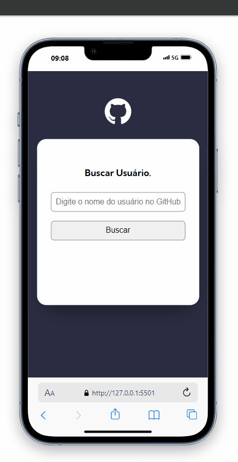

# Project Git Hub API 

    

       Dedicated website for the studiy API Git hub and foundations the javascript.
    

   

     
     

    <h2>🛠️ Technologies and Tools Used</h2>
      
  

  <h2>What I Learned From These Technologies.</h2> 
   I've learned a lot about studying the foundations of javascript , and my second aplication of a API , and it"s very dificult because i'm still  very much a beginner, but a not give up! , and the basic of javascript helped with this project.

## 🔍 About the Project

This project has a focus on developing aplications with a API the Github, basic promises , architecture model using the libary React , pre-data request , filter of the API Github , clean code , folders organization

## 🏗 Structure and Architecture

The project follows the principles of **clean code**, and the code was organized according to the principles of **modularity**.
